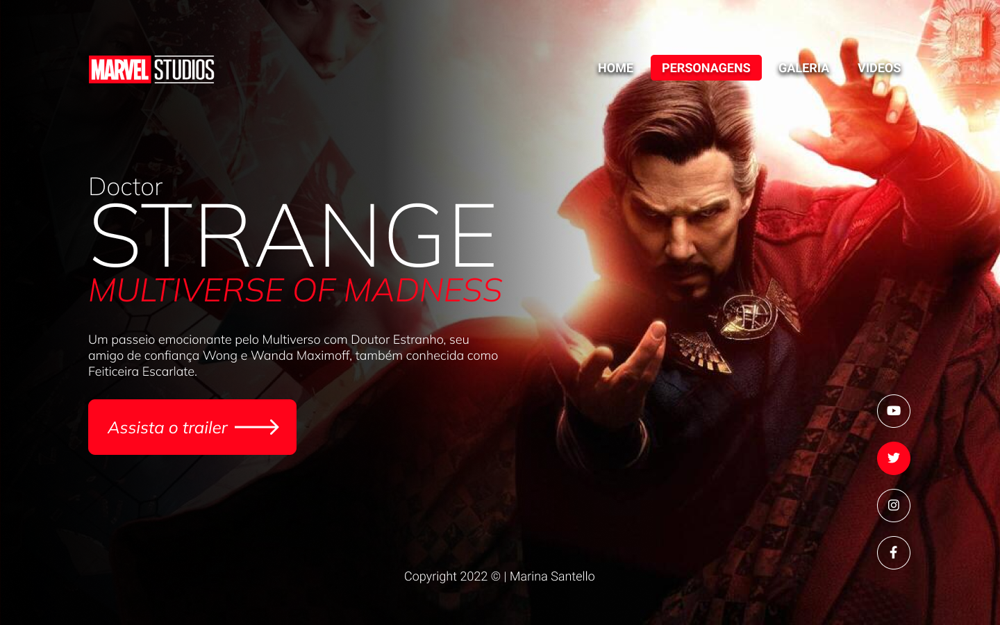
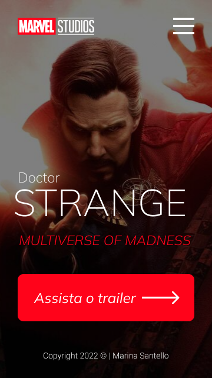
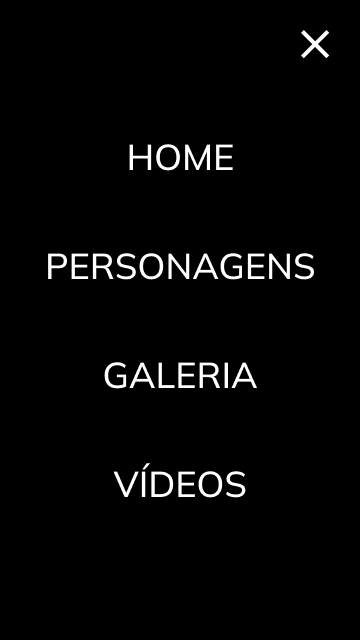

# Doctor Strange

Projeto construído durante as aulas de Linguagem de Marcação, no curso de desenvolvimento de sistemas do [SENAI Jandira](https://jandira.sp.senai.br/), com a orientação do Prof. [Fernando Leonid](https://github.com/fernandoleonid).

---

## Objetivo do projeto

O objetivo era criar uma landing page com base no design feito no Figma, aprendendo a estrutura do HTML, CSS, JS e conceitos de responsividade.

---

## Landing page: conceito

Landing page são páginas com foco principal na conversão de visitantes, assim, essas páginas possuem uma estética mais minimalista comparada com os sites tradicionais.

---

## Tecnologias usadas
- HTML 5;
- CSS 3;
- JavaScript;
- Figma.

---

## Links
- [Resultado](https://marinasantello.github.io/DoctorStrange/)
- [Projeto no Figma](https://www.figma.com/file/n5Jf7ulaQhZH7GuvlaDvTn/ESTRANHO-DOUTOR?node-id=5%3A34)
- [Código](https://github.com/MarinaSantello/DoctorStrange.git)

---

## Autor
### [Marina Santello](https://github.com/MarinaSantello)